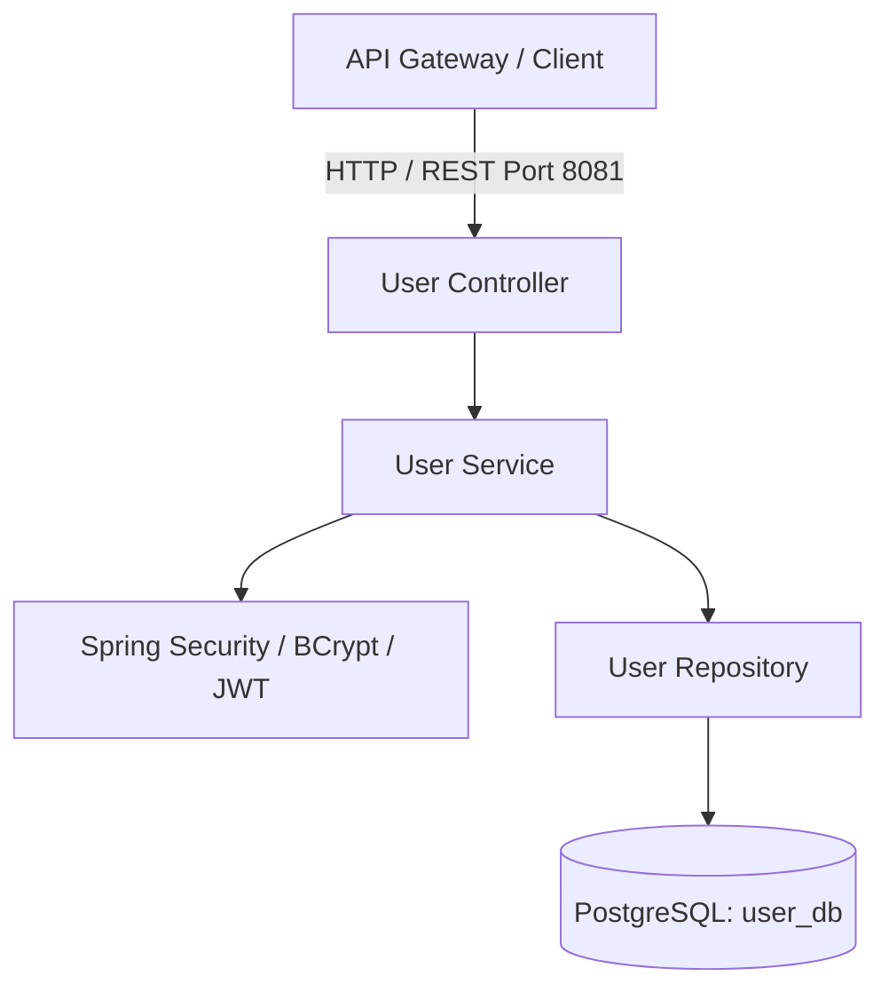

# Event Ticketing - User Service

[](https://github.com/Event-ticket-system-management/event-ticketing-user-service/actions)

## 📌 Overview

`event-ticketing-user-service` is the core microservice responsible for User Authentication, Authorization, and User Profile Management within the Event Ticketing System.

---

## 🏗️ Service Responsibilities

* User registration and account profile management.
* Password hashing using **BCrypt**.
* Authentication & JWT token issuance/validation using **Spring Security**.
* Role-Based Access Control (**RBAC**): `USER`, `ORGANIZER`, `ADMIN`.

---

## 🛠️ Tech Stack & Configuration

| Component                 | Technology / Detail         |
| :------------------------ | :-------------------------- |
| **Language**              | Java 21                     |
| **Framework**             | Spring Boot 4.1.1           |
| **Security**              | Spring Security             |
| **Persistence**           | Spring Data JPA (Hibernate) |
| **Database**              | PostgreSQL (`user_db`)      |
| **Build Tool**            | Maven (`pom.xml`)           |
| **Server Port**           | `8081`                      |
| **Boilerplate Reduction** | Lombok                      |

---

## 📐 Service Architecture



---

## 🚀 Implemented Features

* [x] **User Registration API (`POST /api/v1/user/register`)**

  * Name, email, and password validation.
  * Password hashing using BCrypt.
  * Unique email validation.
  * Returns `409 Conflict` when the email is already registered.
  * Automatic assignment of the `USER` role for newly registered users.
* [x] Request validation.
* [x] Centralized exception handling.
* [x] Secure password storage using BCrypt.
* [x] JWT-based security configuration.
* [x] Role-Based Access Control structure.

---

## 📡 API Endpoints

### 1. Register User

Creates a new user account in the system.

* **URL:** `/api/v1/user/register`
* **Method:** `POST`
* **Headers:** `Content-Type: application/json`

#### Request Body

```json
{
  "name": "Thamindu Weeravardhana",
  "email": "thamindu@gmail.com",
  "password": "Thamindu@1234"
}
```

#### Response — `201 Created`

```json
{
  "id": "a1b2c3d4-e5f6-7890-abcd-1234567890ab",
  "name": "Thamindu Weeravardhana",
  "email": "thamindu@gmail.com",
  "role": "ROLE_USER",
  "createdAt": "2026-09-29T15:00:00"
}
```

### Registration Validation

The registration endpoint validates the submitted user information before creating the account.

The following validations are applied:

* Name must be valid.
* Email must be valid.
* Password must satisfy the configured validation rules.
* Email address must be unique.
* Password must be hashed before being stored in the database.

### Duplicate Email Response

If the provided email address is already registered, the API returns:

```text
HTTP 409 Conflict
```

Example response:

```json
{
  "error": "Conflict",
  "message": "Email is already registered!"
}
```

---

## 🧪 Testing

The User Service uses automated tests to verify the service layer, REST controller layer, request validation, exception handling, password hashing, and database integration.

### Testing Frameworks

* **JUnit 5** – Test execution and lifecycle management.
* **Mockito** – Mocking dependencies for unit tests.
* **MockMvc** – Testing REST API endpoints.
* **Spring Boot Test** – Integration testing with the Spring application context.
* **AssertJ** – Assertions for verifying test results.

### Test Structure

```text
src/test/
├── java/
│   └── com/eventticketing/userservice/
│       ├── controller/
│       │   └── UserControllerTest
│       │
│       ├── service/
│       │   └── UserServiceTest
│       │
│       └── integration/
│           └── UserRegistrationIT
```

---

## 🧪 Test Cases

### User Service Unit Tests

**Test Class:** `UserServiceTest`

#### 1. Successful User Registration

**Test Method:**

```text
registerUser_Success()
```

Verifies that a new user is successfully registered when the email address does not already exist.

The test verifies:

* Email uniqueness check.
* Password encoding.
* User persistence.
* `ROLE_USER` assignment.
* Correct response data.

#### 2. Duplicate Email Validation

**Test Method:**

```text
registerUser_ThrowsException_WhenEmailExists()
```

Verifies that `EmailAlreadyExistsException` is thrown when the email address already exists.

The test also verifies that the user is not saved when the email already exists.

---

### User Controller Tests

**Test Class:** `UserControllerTest`

#### 3. Successful Registration Request

**Test Method:**

```text
register_Success()
```

Verifies that a valid registration request returns:

```text
HTTP 201 Created
```

The response is also verified for:

* Email.
* User role.
* User ID.

#### 4. Registration Validation Error

**Test Method:**

```text
register_ValidationError()
```

Verifies that an invalid registration request returns:

```text
HTTP 400 Bad Request
```

The test uses invalid name, email, and password values.

#### 5. Duplicate Email Conflict

**Test Method:**

```text
register_EmailConflict()
```

Verifies that attempting to register an already registered email returns:

```text
HTTP 409 Conflict
```

The response is verified for:

```json
{
  "error": "Conflict",
  "message": "Email is already registered!"
}
```

---

### Integration Tests

**Test Class:** `UserRegistrationIT`

#### 6. End-to-End Successful Registration

**Test Method:**

```text
registerUser_EndToEnd_Success()
```

Verifies the complete registration flow using the Spring application context and database.

The test verifies:

* `201 Created` response.
* Correct email in the response.
* `ROLE_USER` assignment.
* Generated user ID.
* User persistence in the database.
* Password is not stored as plain text.
* BCrypt password verification succeeds.

#### 7. End-to-End Duplicate Email Conflict

**Test Method:**

```text
registerUser_EndToEnd_DuplicateEmail_Conflict()
```

Verifies that registration fails when the requested email already exists in the database.

Expected result:

```text
HTTP 409 Conflict
```

The response must contain:

```json
{
  "error": "Conflict",
  "message": "Email is already registered!"
}
```

---

## 📊 Test Case Summary

| Test Class           | Test Method                                       | Test Type        | Expected Result                      |
| :------------------- | :------------------------------------------------ | :--------------- | :----------------------------------- |
| `UserServiceTest`    | `registerUser_Success()`                          | Unit Test        | Successful registration              |
| `UserServiceTest`    | `registerUser_ThrowsException_WhenEmailExists()`  | Unit Test        | `EmailAlreadyExistsException`        |
| `UserControllerTest` | `register_Success()`                              | Controller Test  | `201 Created`                        |
| `UserControllerTest` | `register_ValidationError()`                      | Controller Test  | `400 Bad Request`                    |
| `UserControllerTest` | `register_EmailConflict()`                        | Controller Test  | `409 Conflict`                       |
| `UserRegistrationIT` | `registerUser_EndToEnd_Success()`                 | Integration Test | `201 Created` + Database persistence |
| `UserRegistrationIT` | `registerUser_EndToEnd_DuplicateEmail_Conflict()` | Integration Test | `409 Conflict`                       |

---

## ▶️ Running Tests

### Run All Tests

Run the complete test suite using Maven:

```bash
mvn test
```

### Run Unit Tests

```bash
mvn test -Dtest=UserServiceTest
```

### Run Controller Tests

```bash
mvn test -Dtest=UserControllerTest
```

### Run Integration Tests

```bash
mvn test -Dtest=*IT
```

### Run a Specific Test Class

```bash
mvn test -Dtest=UserServiceTest
```

---

## 🧹 Test Data Cleanup

The integration tests clean up persisted users after each test execution using `@AfterEach`.

```java
@AfterEach
void cleanUp() {
    userRepository.deleteAll();
}
```

This ensures that test data from one integration test does not affect another test.

---

## 🔐 Password Security Testing

The integration test verifies that passwords are not stored as plain text.

The test confirms that:

* The stored password is different from the original password.
* The stored password can be successfully verified using the configured `PasswordEncoder`.

```java
assertThat(savedUser.getPassword()).isNotEqualTo("Thamindu@1234");

assertThat(passwordEncoder.matches(
        "Thamindu@1234",
        savedUser.getPassword()
)).isTrue();
```

---

## 🐳 Docker & Containerization

The User Service is containerized using a multi-stage `Dockerfile` to provide a consistent and secure runtime environment.

### Features

* **Multi-stage build:** Eclipse Temurin JDK 21 (Builder) → JRE 21 Alpine (Runtime).
* **Security:** The application runs as a non-root `appuser` for improved container security.
* **Health Check:** The application provides an Actuator `/actuator/health` endpoint for container health monitoring.

---

### 1. Build Docker Image

Build the Docker image from the project root directory:

```bash
docker build -t event-ticketing-user-service:1.0.0 .
```

---

### 2. Run Container with Environment Variables

The container can be started using an `.env` file to provide the required environment variables:

```bash
docker run -d \
  --name event-ticketing-user-service \
  --network event-ticketing-infrastructure_event-ticketing-network \
  -p 8081:8081 \
  --env-file .env \
  event-ticketing-user-service:1.0.0
```

---

### 3. Environment Variables Specification

| **Variable**  | **Required** | **Description**                | **Example / Default**                     |
| :------------ | :----------- | :----------------------------- | :---------------------------------------- |
| `SERVER_PORT` | No           | Application Port               | `8081`                                    |
| `DB_URL`      | **Yes**      | PostgreSQL JDBC Connection URL | `jdbc:postgresql://postgres:5432/user_db` |
| `DB_USERNAME` | **Yes**      | Database Username              | `postgres`                                |
| `DB_PASSWORD` | **Yes**      | Database Password              | `postgrespassword`                        |

> Do not commit `.env` files containing real credentials or sensitive information to the repository.

---

### 4. Container Health Verification

Check the running container and its health status:

```bash
docker ps
```

View the application logs:

```bash
docker logs -f event-ticketing-user-service
```

Check the Spring Boot Actuator health endpoint:

```bash
curl http://localhost:8081/actuator/health
```

A healthy application should return:

```json
{
  "status": "UP"
}
```

---

## ⚙️ Continuous Integration (CI) Pipeline

The User Service uses a GitHub Actions CI pipeline to ensure that code changes meet the required quality standards before they are integrated into the `develop` or `main` branches.

### Pipeline Structure

* **Workflow File:** `.github/workflows/ci.yml`
* **Runner OS:** `ubuntu-latest`
* **Java Version:** JDK 21 (Temurin)

### Quality Gates

The CI pipeline validates the following quality gates:

1. **Code Compilation** — If the project fails to compile, the pipeline fails.
2. **Automated Tests** — If any unit or integration test fails, the pipeline fails.
3. **Docker Build** — If the Docker image build fails, the pipeline fails.

If any quality gate fails, the Pull Request is blocked from being merged into the `develop` branch until the issue is resolved.

### CI Pipeline Flow

```text
Developer Push / Pull Request
            │
            ▼
     GitHub Actions CI
            │
            ▼
       JDK 21 Setup
            │
            ▼
     Code Compilation
            │
            ▼
     Unit & Integration Tests
            │
            ▼
       Docker Build
            │
       ┌────┴────┐
       ▼         ▼
     PASS       FAIL
       │         │
       ▼         ▼
   Pipeline    Pipeline
   Passes      Fails
       │         │
       ▼         ▼
  PR Can Be    PR Blocked
  Merged       Until Fixed
```
